FL Senate Scraper
==============

Parse FL senate pages for information about bills and which congress persons voted for the bills.

This project uses [Node.js](https://nodejs.org/) to download the bill pages and PDFs containing the vote tallies. It parses that information and generates CSV or JSON files containing the results.
* URLs for bills assume the form (can be changed in [src/scrapeBillPage.ts](src/scrapeBillPage.ts)): `https://www.flsenate.gov/Session/Bill/{year}/{billId}`
* The session year and bill are passed as command line arguments like: `node ./dest/index.js --year=2022 --bill=100,102,105 --outFile=output.(json|csv)`
* The output file path/name is relative to the current directory
* All vote PDFs are loaded and parsed. Only the latest vote from 'House' and latest vote from 'Senate' are output; there may be multiple parsed votes per chamber
* Results can be saved to CSV or JSON file format (or written to stdout/console as JSON if no `outFile` is specified)
* The JSON file output schema is defined in [@types.d.ts](src/%40types.d.ts):
  ```TS
    BillAndVotesParsed[]
  ```
* The CSV file output format is:
  ```CSV
  House
  bill_id,# - name,# - name,# - name
  100,Y,,N
  Senate
  bill_id,# - name,# - name,# - name
  200,N,,Y
  ```
* To see more detailed bill and vote information, set the `DEBUG` env variable, like `set DEBUG=* & node ./dest/index.js --year=2022 --bill=100 --outFile=output.csv`, this causes a `raw_output.json` file to be written in the current directory

Resources:

To find your Florida congress person:
* https://www.myfloridahouse.gov/Sections/Representatives/myrepresentative.aspx

To find your Florida senator:
* https://www.flsenate.gov/Senators

A full list of laws can be retrieved from http://laws.flrules.org/node > pick \[year\] > click Apply.

TODO:
* Handle "Votes after roll call:" present in some PDFs, like [this one](https://www.flsenate.gov/Session/Bill/2022/434/Vote/SenateVote_s00434__018.PDF)

---
## Usage

To run this on your computer, you'll need a Javascript runtime. Preferably [Node.js](https://nodejs.org/) because this project is written in `TypeScript/Javascript`.

[Download Node.js](https://nodejs.org/en/download/) and install it. You can skip adding the `corepack` package manager, skip adding node to your computer path, and skip installing necessary tools. We won't need any of that to run this project.

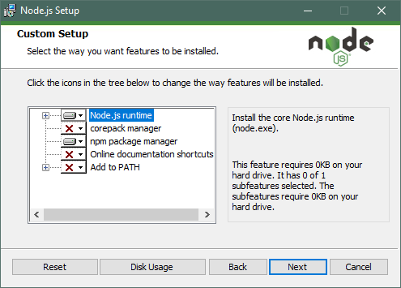
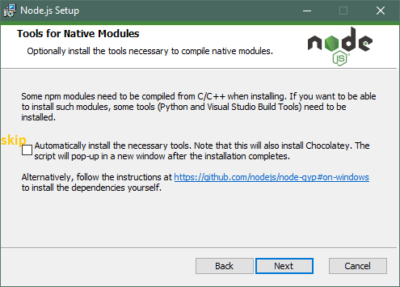

Now, in your web browser go to the [Tags](https://github.com/TeamworkGuy2/fl-senate-scraper/tags) page of the project and download the `zip` or `tar.gz` of the latest release version. The latest version will be the first item at the top of the list.

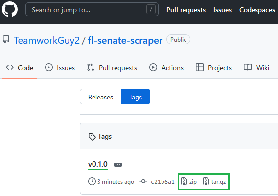

Unzip the downloaded file and open up the folder.

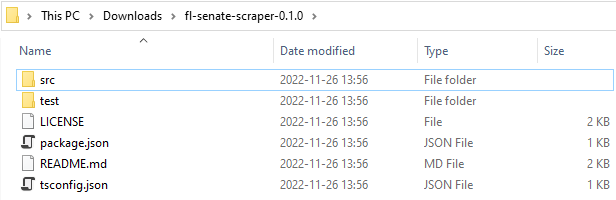

Find and open the `Node.js command prompt` that you installed earlier. If you're using Windows, this can be found by opening the start menu and searching for `node`, it should look like this:

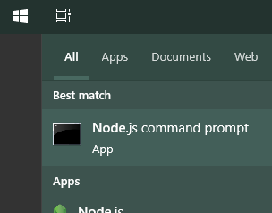

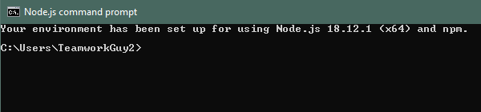

In the `Node.js command prompt`, `cd` into the project directory and press enter (`cd` is a command you run to navigate to a specific directory to run commands in that directory):

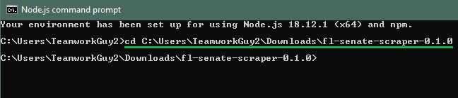

Now install dependencies by running `npm install` in the Node.js command prompt:

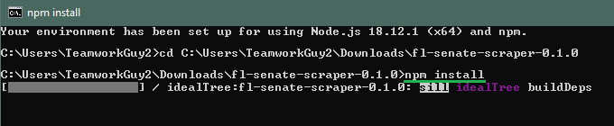

Build the project by running `npm run build` in the Node.js command prompt:

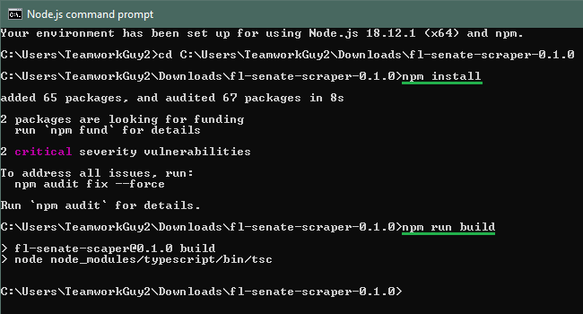

And run the project for the specific senate bills you wish to retrieve by running a command similar to:
```sh
node ./dest/index.js --year=2022 --bill=100 --outFile=output.csv
```

Where the `year`, `bill` and `outFile` values can be customized, see details at the top of this README file.

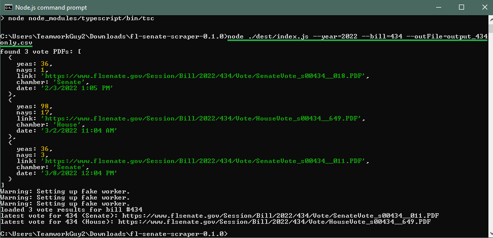

An output file will be generated assuming there are no issues accessing and downloading data from flsenate.gov!

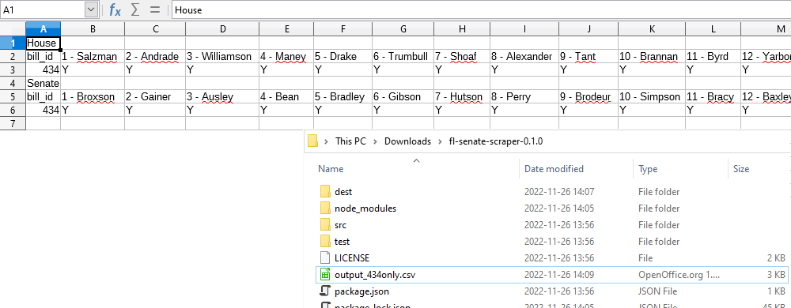